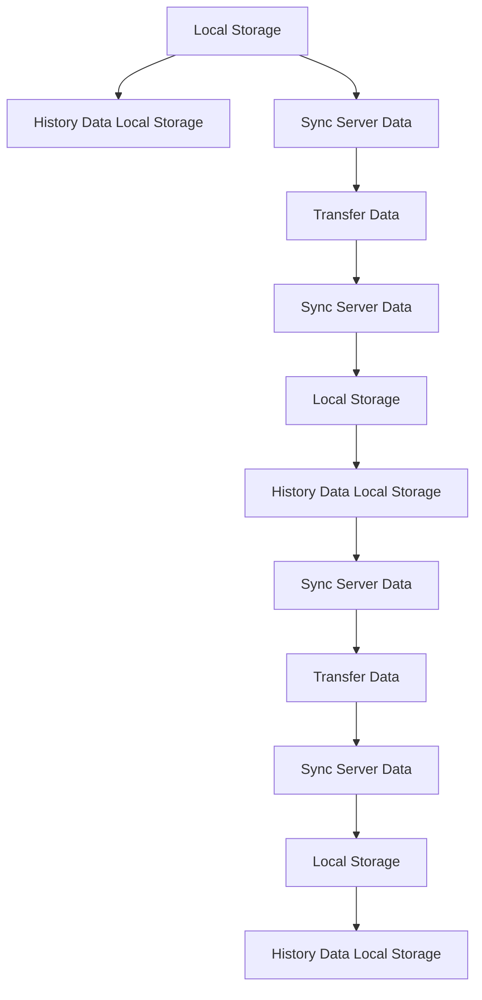

Solution Sync Server Data Sample 

- Sync Server Data Sample
- Local Storage 
- Transfer Data 

```mermaid
graph TD
    A[Local Storage] --> B[History Data Local Storage]
    A --> C[Sync Server Data]
    C --> D[Transfer Data]
    D --> E[Sync Server Data]
    E --> F[Local Storage]
    F --> G[History Data Local Storage]
    G --> H[Sync Server Data]
    H --> I[Transfer Data]
    I --> J[Sync Server Data]
    J --> K[Local Storage]
    K --> L[History Data Local Storage]
```